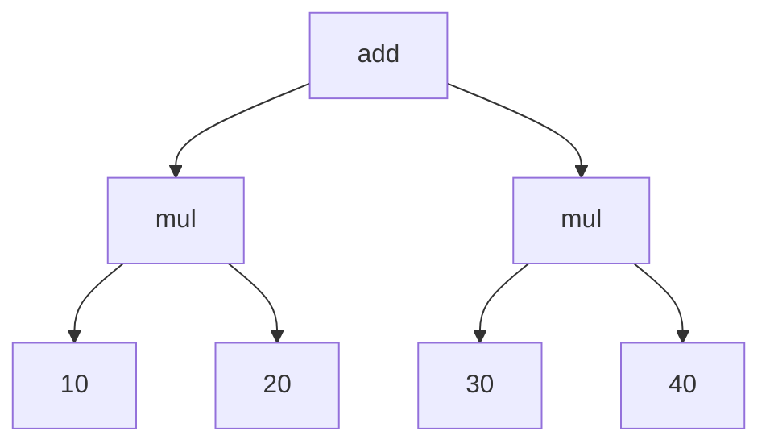

# DAG operators

Directed Acyclic Graphs (DAGs) are used in compiler construction a lot to represent operation and type hierarchies along with other metadata in the form of Abstract Syntax Trees (AST). ASTs are a kind of a DAG with some constraints. Don't worry about the specifics right now. We will get plenty of practice in later chapters. For now just remember that a DAG unit (called a node) in TableGen consists of an Operator and zero or more Arguments. Arguments can be DAG nodes too so we can create hierarchies of nodes. I've used my excellent `mermaid` skills to create this illustration for you (you know you're learning from the best):

<center>

</center>

!!!note
    Again, skim over the following operators. I have rarely used them in the context of writing compiler components but I have seen them being used in some library implementations, so just get a cursory idea for now. MLIR implicitly creates ASTs for your compiler, so you won't find yourself doing any sort of DAG manipulation in TableGen as you might expect.

```tablegen
/// dagops.td

#ifndef DAGOPS
#define DAGOPS

include "setup.td"

def DagOps {
  // !dag(operator, args, argNames) - creates a dag
  dag binOp1 = !dag(addOp, [10, 20], ["op1", "op2"]); // creates: (addOp 10:$op1, 20:$op2)
  
  // To explain the assert, we convert the dag into its string representation
  // and check it for equality with our expected value. Note that you
  // can compare two dags for equality using !eq, but since we are
  // merely ensuring that the dag was created, we check it against the string representation.
  assert !eq(!repr(binOp1), "(addOp 10:$op1, 20:$op2)"), errorStr;
  
  // !getdagarg<type>(dag,key) 
  // get the value of an argument with it's `key` 
  // where key can be a name or index.
  int op1_v = !getdagarg<int>(binOp1, "op1"); // 10
  assert !eq(op1_v, 10), errorStr;

  int op2_v = !getdagarg<int>(binOp1, 1); // 20
  assert !eq(op2_v, 20), errorStr;
 
  // !setdagname(dag,key,name) - create a new dag with an argument renamed
  dag binOp2 = !setdagname(binOp1, "op2", "op3"); // creates: (addOp 10:$op1, 20:$op3)
  assert !eq(!repr(binOp2), "(addOp 10:$op1, 20:$op3)"), errorStr;

  // !setdagarg(dag,key,value) - create a new dag with an argument changed
  dag binOp3 = !setdagarg(binOp2, 0, 20); // creates: (addOp 20:$op1, 20:$op3)
  assert !eq(!repr(binOp3), "(addOp 20:$op1, 20:$op3)"), errorStr;
 
  // !setdagop(dag,op) - create a new dag with an operator changed
  dag binOp4 = !setdagop(binOp3, mulOp); // creates: (mulOp 20:$op1, 20:$op3)
  assert !eq(!repr(binOp4), "(mulOp 20:$op1, 20:$op3)"), errorStr;
 
  // foreach applied to dags
  list<int> op1s = !foreach(dg, [binOp1, binOp3], !getdagarg<int>(dg, "op1")); // [10, 20] 
  assert !eq(!repr(op1s), "[10, 20]"), errorStr;
  
  // !getdagop<type>(dag) - get the operator of a dag
  Op op = !getdagop<Op>(binOp1); // addOp
  assert !eq(op, addOp), errorStr;
 
  // !con(dag1, dag2) - concatenate two dags
  // Below we have:
  // !con((addOp 10:$op1, 20:$op2), (addOp 20:$op1, 20:$op3))
  dag combinedOps = !con(binOp1, binOp3);
  // NOTE: Since both dags have $op1, we have two $op1 nodes. 
  assert !eq(!repr(combinedOps), "(addOp 10:$op1, 20:$op2, 20:$op1, 20:$op3)"), errorStr;
  // Attempting to access the value of op1 will return the value of the first node with that name.
  int combined_op_v = !getdagarg<int>(combinedOps, "op1"); // 10
  assert !eq(combined_op_v, 10), errorStr;
 
  // !getdagname(dag,index) - get the name of an argument
  string name_v = !getdagname(binOp1, 0); // "op1"
  assert !eq(name_v, "op1"), errorStr;  
 
  // size(a) as applied to dags
  int size_v = !size(binOp1); // 2
  assert !eq(size_v, 2), errorStr;
 
  // A dag is considered empty if it has no arguments. The operator does not count.
  bit empty_f = !empty(binOp1); // 0
  assert !eq(empty_f, 0), errorStr;

  dag emptyDag = !dag(addOp, []<int>, []<string>);
  bit empty_t = !empty(emptyDag); // 1
  assert empty_t, errorStr; 

  // IMPORTANT NOTE: We could have created dags using a string for the op. 
  // So this would be valid:
  dag binOp5 = !dag("myOp", [10, 20], ["op1", "op2"]);
  assert !eq(!repr(binOp5), "(\"myOp\" 10:$op1, 20:$op2)"), errorStr;
  // But when we combine two dags, the operator has to be equal. 
  // And two identical strings are not equal in TableGen because
  // they point to different memory locations (confusing I know.)
  dag binOp6 = !dag("myOp", [10, 20], ["op3", "op4"]);
  // The following attempt to combine them will fail. 
  // dag combinedOps2 = !con(binOp5, binOp6);
  //  error: Initializer of 'combinedOps2' in 'DagOps' could not be fully resolved: 
  // !con(("myOp" 10:$op1, 20:$op2), ("myOp" 10:$op3, 20:$op4))
  // This is because !con will only work if the operator is the same.
  // However the two "myOp" strings in binOp5 and binOp6 are considered different.
  // Which is why we use records as ops (as we've done with addOp in our examples above).
}

#endif // DAGOPS
```
