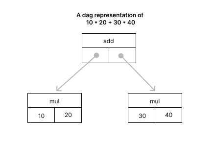

# Notes on TableGen

In the following notes, we explore TableGen features in the context of the MLIR pipeline. We do this at a leisurely pace. There’s plenty of code examples, so maybe fire up the laptop to read this if you haven’t already.

For a more general discussion on TableGen which you can check out the official docs. They are a bit too verbose for my liking but should be considered as the de-facto source for documentation (clearly). 

## Prequisites

Make sure you have llvm built locally or installed using homebrew or one of the several other options. Because TableGen is used only in the context of MLIR/LLVM, the llvm-tblgen binary is not copied into the usr/bin directory. Ensure that it’s in your path. 

# Introduction
## What is TableGen?
TableGen is a data definition language and allows one to specify what it calls records. A backend can parse the records and use as needed. Here’s a quick example so we aren’t running blind.

```c
class Compiler {
  string version = "1.0";
  string target = "arm64-apple-macosx"; 
}
```

It’s ok not to understand everything. And it’s ok to think this looks suspiciously like C++. Because it does. But it is not C++ as will be apparent in later examples.

## How does MLIR use it?
In the context of MLIR, TableGen files you write will describe different components of the compiler allowing an MLIR backend to generate C++ classes and helper functions for your compiler. This approach is quicker, cleaner, and more efficient than writing the C++ classes yourself. It also encourages adherence to certain guidelines, as we’ll explore in later chapters, leading to a more consistent development process.

**Note:** You can even write your own custom backend, though this won’t be covered or necessary in our case.

## Why do I need to learn a new language?
Why not just use JSON, YAML, or any one of the several available options? While we could, TableGen provides additional features like templates, class hierarchies, macros, and preprocessing, allowing us to minimize repetition and reduce the complexity of specifying information. However, the question of the usefulness of TableGen has been discussed within the community as well. For now this is their tool of choice, so we run with it.

# Terminology
TableGen specs primarily contain two types of records: abstract records called classes, and concrete records, confusingly called records in the official documentation (I’ll explain the abstract/concrete bifurcation in a minute). To complicate things further, when you look at the TableGen output, it refers to concrete records as “Defs” since we define a concrete record using the def keyword 🙄 But the intended meaning should usually be clear from the context in the documentation. To keep things simple, I’ll refer to concrete records as defs and use records to refer to both abstract and concrete records..

The abstract/concrete distinction is similar to the difference between classes and instances in object-oriented programming. A quick example will make this clearer:

```c
/// sample.td
// class (defined using the `class` keyword)
class ArithmeticOperator {
  string mnemonic; // field defined with its type
}
 
// record (defined using the `def` keyword : creates an instance of ArithmeticOperator)
def AddOp : ArithmeticOperator {
  let mnemonic = "add"; // field initialized using `let`
}
 
def MulOp : ArithmeticOperator {
  let mnemonic = "mul"; // field initialized using `let`
}
```

In this example, ArithmeticOperator is the abstract definition (the class), while AddOp and MulOp are concrete instances (the defs).

We run this through the llvm-tblgen command-line utility (I’m using the homebrew version), without specifying any backend like so:

```bash	
/opt/homebrew/opt/llvm/bin/llvm-tblgen sample.td
```

we get the following output on the console:

```c
------------- Classes -----------------
class ArithmeticOperator {
  string mnemonic = ?;
}
------------- Defs -----------------
def AddOp {     // ArithmeticOperator
  string mnemonic = "add";
}
def MulOp {     // ArithmeticOperator
  string mnemonic = "mul";
}
```

# Templates
Not unlike C++, in TableGen, templates allow us to pass initialization values to classes. Let’s dive into an example:

```c
// Base class for all Traits (shared behaviour among classes/instances)
class Trait {}
 
// Operator class takes two template variables mnemonicString and traitItem.
// These variables are stored in the class.
// Initializing variables to '?' means they currently hold an undefined value.
class Operator<string mnemonicString = ?, Trait traitItem = ?> {
  string mnemonic = mnemonicString;
  Trait trait = traitItem;
}
 
// A concrete record
def ArithmeticOperatorTrait : Trait {}
 
// A derived class
class ArithmeticOperator<string mnemonic, Trait trait = ArithmeticOperatorTrait> 
  : Operator<mnemonic, trait>;
 
 
// Concrete records
def AddOp : ArithmeticOperator<"add">; 
def MulOp : ArithmeticOperator<"mul">;
```

When you run this file through TableGen, it generates the following records. Notice that classes and defs are listed in alphabetical order, not hierarchical. Also, TableGen flattens and merges all the fields from parent classes and templates into the final def. This way, each def stands alone without referencing its parent, except in the comments.

```c
------------- Classes -----------------
class ArithmeticOperator<string ArithmeticOperator:mnemonic = ?, 
 Trait ArithmeticOperator:trait = ArithmeticOperatorTrait> {    // Operator
  string mnemonic = ArithmeticOperator:mnemonic;
  Trait trait = ArithmeticOperator:trait;
}
class Operator<string Operator:mnemonicString = ?, 
 Trait Operator:traitItem = ?> {
  string mnemonic = Operator:mnemonicString;
  Trait trait = Operator:traitItem;
}
class Trait {
}
------------- Defs -----------------
def AddOp {     // Operator ArithmeticOperator
  string mnemonic = "add";
  Trait trait = ArithmeticOperatorTrait;
}
def ArithmeticOperatorTrait {   // Trait
}
def MulOp {     // Operator ArithmeticOperator
  string mnemonic = "mul";
  Trait trait = ArithmeticOperatorTrait;
}
```

# Types
So far, we’ve been working mainly with string and custom classes in our examples. However, TableGen offers a few other types and operators. This is already an improvement over JSON because in our case TableGen type-checks everything for us. Let’s quickly go through the available types. There aren’t many, and they’re fairly straightforward.

```c
// Used in TypeExample
class BinaryOp {}
def op : BinaryOp {}
  
// We don't really need multiple instances of TypeExample
// so we just put everything in a definition instead of
// having a class, and then instantiating it with def.
def TypeExample {
  // Bit type.
  bit bitV = 1; 
  
  // There’s no dedicated boolean type in TableGen.
  // Use `bit` for boolean values. However, TableGen
  // provides `true` and `false` keywords, which are
  // automatically converted to 1 and 0.
  bit falseV = false; // Converted to 0.
  
  // We will explain `assert` and `!eq` (which is bang-equal and not not-equal) 
  // later in the tutorial. For now, just know that they do exactly what you'd expect.
  assert !eq(falseV, 0), "Expected falseV to be 0";
  
  bit trueV = true; // Converted to 1.
  assert !eq(trueV, 1), "Expected trueV to be 1";
  
  bit alsoTrueV = 1; // Cast into a bit.
  assert !eq(alsoTrueV, true), "Expected alsoTrueV to be true";
  assert !eq(alsoTrueV, 1), "Expected alsoTrueV to be 1";
  
  // Integer type.
  int intV = -1;
  
  // String type.
  string stringV = "stringVal";
  
  // `bits` type: a sequence of bits.
  bits<4> bitsV1 = {0, 1, 0, 1}; // Set individual bits.
  bits<4> bitsV2 = 5; // Or set them all at once.
  assert !eq(bitsV1, bitsV2), "Expected bitsV1 and bitsV2 to be equal"; 
  
  // Lists of any type, like in C++.
  list<int> listV = [10, 20, 30, 40];
  list<string> stringList = ["a", "b", "c", "d"];
  
  // We’ll cover `dag` later.
  dag dagV = !dag(op, [10, 20], ["op1", "op2"]);
  
  // Uninitialized values can be specified using a question mark (?).
  // The following two definitions are equivalent.
  string uName1;
  string uName2 = ?;
    
  // ! (bang) operators won't work on uninitialized data. We will learn them in a bit.
  // The following line won't work:  
  // assert !eq(uName1, uName2), "Expected uName1 and uName2 to be uninitialized";
  // Uncommenting will throw the following error:
  // error: assert condition must be of type bit, bits, or int.
}
```

**Note:** TableGen only supports decimal types i.e. floating point numbers won’t even parse. While this might seem like a gross omission, I haven’t seen any instances within the compiler construction framework where I wished I had floating point support. Having said that, if you absolutely MUST use floating point numbers in your code generation, you could represent them as strings and allow the backend to parse said strings.

# Multi-classes
This is where we depart from the OOP-ness of TableGen classes. Whereas a class allows you to generate a def, a multi-class allows you to generate multiple defs. That’s pretty much it. Why do we need these? I’ve only ever seen them being useful for low-level code where you want to generate defs for different architectures. Let’s see some simplified examples:

```c
// For now we use an empty instruction.
class Instruction{}
 
// Multiclass will take a single instruction
// and then create multiple records out of it.
multiclass InstructionM {
  // We want to generate two different variations of each instruction.
  def _amd : Instruction{}
  def _intel : Instruction{}
}
 
// You can "invoke" a multiclass using defm
defm ADD : InstructionM; 
// If you see the output, you will see some defm weirdness.
// So let's go through the generation process step by step.
//
// defm ADD : InstructionM invokes the multiclass.
//
// TableGen then generates new records as expected. 
// But the names of the records are prepended with the variable name.
// So instead of generating records _amd, and _intel,
// it will generate 
// ADD_amd, and 
// ADD_intel
 
defm MUL : InstructionM;
// Similarly the above will generate 
// MUL_amd, and 
// MUL_intel
```

See the output:

```c
------------- Classes -----------------
class Instruction {
}
------------- Defs -----------------
def ADD_amd {   // Instruction
}
def ADD_intel { // Instruction
}
def MUL_amd {   // Instruction
}
def MUL_intel { // Instruction
}
```

Here’s a more involved example.

```c
// Define a class for instructions with a 4-bit opcode 
// and an assembly name.
class InstructionWithOpcode {
   bits<4> opcode;
   string asm;
}
 
// Define a multiclass that generates two variations 
// of each instruction with the specified opcode and assembly name.
multiclass InstructionWithOpcodeM<bits<4> OpcodeA, bits<4> OpcodeB, string Asm> {
  def _amd : InstructionWithOpcode {
    bits<4> opcode = OpcodeA;
    string asm = Asm;
  }
  def _intel : InstructionWithOpcode {
    bits<4> opcode = OpcodeB;
    string asm = Asm;
  }
}
 
// Invoke the multiclass to generate the records with 
// different opcodes and assembly names.
defm ADD : InstructionWithOpcodeM<0b0000, 0b0001, "add">;
// This will generate records:
// ADD_amd with opcode 0b0000 and asm "add"
// ADD_intel with opcode 0b0001 and asm "add"
 
defm SUB : InstructionWithOpcodeM<0b0010, 0b0011, "sub">;
// This will generate records:
// SUB_amd with opcode 0b0010 and asm "sub"
// SUB_intel with opcode 0b0011 and asm "sub"
```

And here's the output:

```c
------------- Classes -----------------
class InstructionWithOpcode {
  bits<4> opcode = { ?, ?, ?, ? };
  string asm = ?;
}
------------- Defs -----------------
def ADD_amd {   // InstructionWithOpcode
  bits<4> opcode = { 0, 0, 0, 0 };
  string asm = "add";
}
def ADD_intel { // InstructionWithOpcode
  bits<4> opcode = { 0, 0, 0, 1 };
  string asm = "add";
}
def SUB_amd {   // InstructionWithOpcode
  bits<4> opcode = { 0, 0, 1, 0 };
  string asm = "sub";
}
def SUB_intel { // InstructionWithOpcode
  bits<4> opcode = { 0, 0, 1, 1 };
  string asm = "sub";
}
```

# What’s bang(!)-ing
TableGen has a bunch of bang (!) operators. Instead of explaining each one of them individually, I’ll resort to showing you code examples of each of them along with explanations where necessary.

**Note:** Skim through these. In the context of MLIR, we don’t use these as much but you might come across uses in the library source code in which case it’s helpful to have some reference point.

## Setup
Some basic setup code for our operator examples. We put this in a separate file setup.td and include it in our code samples as necessary.

```c
/// setup.td
 
#ifndef SETUP
#define SETUP
 
// Some simple classes and defs to be used in the operator examples.
class Op {
  string name;
}
  
def addOp : Op { let name = "add"; }
def mulOp : Op { let name = "mul"; }
def divOp : Op { let name = "div"; }
 
// defvar is to define a global variable
// We just use this as a standin for errors
// that would have been reported if our
// assertions failed. 
defvar errorStr = "error";
 
#endif // SETUP
```

## Unary ops
```c
/// unaryops.td
#ifndef UNARYOPS
#define UNARYOPS
 
// Notice we don't have the # sign in front of the include like we do in C++
include "setup.td"
 
def UnaryOps {
  // !repr(value)
  // Represents value as a string. 
  // String format for the value might change over TableGen versions,
  // so don't rely on it being exact.
  // Intended for debugging purposes only.
  string addOp_s = !repr(addOp); 
  // "addOp {       // Op
  //  string name = "add";
  // }
  //";
  
  // Base 2 log 
  int logtwo_v = !logtwo(2); // 1
  assert !eq(logtwo_v, 1), errorStr;
    
  // logical shift performed on a 64-bit integer
  // value undefined if count < 0 or count > 63
  // The shift function naming convention is a bit odd.
  // SHift Left logical -> shl
  int shl_v = !shl(1, 3); // 8
  assert !eq(shl_v, 8), errorStr;
 
  // Shift Right Logical -> srl
  int srl_v = !srl(8, 3); // 1
  assert !eq(srl_v, 1), errorStr; 
 
  // Shift Right Arithmetic -> sra
  int sra_v = !sra(-8, 3); // -1
  assert !eq(sra_v, -1), errorStr; 
    
  // !not(a)
  bit not_t = !not(true); // 0
  assert !eq(not_t, 0), errorStr;
 
  bit not_f = !not(false); // 1
  assert !eq(not_f, 1), errorStr;
 
  // works on 0 and 1 like it would on true/false
  bit not_1 = !not(1); // 0
  assert !eq(not_1, 0), errorStr;
 
  // any non-zero number (positive or negative) is true. 
  // so !not(non_zero_number) = 0 ie false.
  bit not_2 = !not(-2); 
  assert !eq(not_2, 0), errorStr;
  
  // !empty(a)
  // This operator produces 1 if the string, list, or DAG a is empty; 0 otherwise. 
  // A dag is empty if it has no arguments; the operator does not count.
  bit empty_string = !empty("");  
  assert empty_string, errorStr; 
  
  // size(a)
  int size_hello = !size("Hello, World!"); // 13
  assert !eq(size_hello, 13), errorStr;
 
  int size_list = !size([1, 2, 3]); // 3
  assert !eq(size_list, 3), errorStr;
}
 
#endif // UNARYOPS
```

## Binary Ops

```c
/// binaryops.td
 
#ifndef BINARYOPS
#define BINARYOPS
 
include "setup.td"
  
def BinaryOps {
  // !add(a, b, ...) // any number of operands
  int add_v = !add(10, 50, -59);  // 1
  assert !eq(add_v, 1), errorStr;
   
  // Binary arithmetic operators of the form
  // !op(a, b)
  int sub_v = !sub(100, 99); // 1
  assert !eq(sub_v, 1), errorStr;
  
  int mul_v = !mul(2, 3, 4); // 24
  assert !eq(mul_v, 24), errorStr;
  
  int div_v = !div(100, 100);  
  assert !eq(div_v, 1), errorStr;
   
  // Binary logical operators of the form
  // !op(a, b)
  bit eq_v = !eq(10, 10); // true, converted to 1
  assert eq_v, errorStr;
  
  bit ne_v = !ne(10, 11); // 1
  assert ne_v, errorStr;
  
  bit gt_v = !gt(11, 10); // 1
  assert gt_v, errorStr;
  
  bit ge_v = !ge(11, 10); // 1
  assert ge_v, errorStr;
  
  bit lt_v = !lt(10, 11); // 1
  assert lt_v, errorStr;
  
  bit le_v = !le(10, 11); // 1
  assert le_v, errorStr;
     
  // Logical operators of the form
  // !op(a, b, ...)
  bit and_v = !and(true, true, true); // 1
  assert and_v, errorStr;
  
  bit or_v = !or(false, false, false, true); // 1
  assert or_v, errorStr;
  
  bit xor_v = !xor(true, false, false, false, false); // 1
  assert xor_v, errorStr;
}
 
#endif // BINARYOPS
```

## String ops

```c
/// stringops.td
#ifndef STRINGOPS
#define STRINGOPS
 
include "setup.td"
 
def StringOps {
  // strconcat(str1, str2, ...)
  string str_c = !strconcat("Hello, ", "World!"); // "Hello, World!"
  assert !eq(str_c, "Hello, World!"), errorStr;
  
  // !subst(target, repl, value)
  // replace target with repl in value
  string str_s = !subst("World", "Universe", "Hello World World!"); // "Hello Universe Universe!"
  assert !eq(str_s, "Hello Universe Universe!"), errorStr;
  
  // !tolower(a)
  string str_t = !tolower("Hello World"); // "hello world"
  assert !eq(str_t, "hello world"), errorStr;
  
  // !toupper(a)
  string str_u = !toupper("Hello World"); // "HELLO WORLD"
  assert !eq(str_u, "HELLO WORLD"), errorStr;
  
  // !find(string1, string2[, start])
  int index1 = !find("Hello World", "World"); // 6
  assert !eq(index1, 6), errorStr;
 
  int index2 = !find("Hello World", "World", 6); // 6
  assert !eq(index2, 6), errorStr;
 
  int index3 = !find("Hello World", "World", 7); // -1
  assert !eq(index3, -1), errorStr;
}
 
#endif // STRINGOPS
```

## List ops

```c
/// listops.td

#ifndef LISTOPS
#define LISTOPS

include "setup.td"

def ListOps {
    // Lists and related operations
  list<int> lst_1 = [10, 20];
  list<int> lst_2 = [30, 40];
  
  // !listconcat(list1, list2, ...) // any number of lists allowed
  list<int> lst_c = !listconcat(lst_1, lst_2); // [10, 20, 30, 40]
  assert !eq(!repr(lst_c), "[10, 20, 30, 40]"), errorStr;

  // !listremove(list1, list2) // remove elements of list2 from list1 
  list<int> lst_r = !listremove(lst_c, lst_2); // [10, 20]
  assert !eq(!repr(lst_r), "[10, 20]"), errorStr;
  
  // !head(list) - Produces the zeroth element of the list a
  int h = !head(lst_c); // 10
  assert !eq(h, 10), errorStr;

  // !tail(list) - Removes the head of the list
  list<int> t = !tail(lst_c); // [20, 30, 40] 
  assert !eq(!repr(t), "[20, 30, 40]"), errorStr;
  
  // "Splat" means replicating a value multiple times to fill a larger structure. 
  // Here, the value 1 is repeated 3 times to create the list [1, 1, 1].
  list<int> lst_s = !listsplat(1, 3); // [1, 1, 1]
  assert !eq(!repr(lst_s), "[1, 1, 1]"), errorStr;
  
  // !foreach(var, sequence, expr)
  list<int> foreach_v = !foreach(px, [1,2,3], !mul(px,2)); // [2, 4, 6]
  assert !eq(!repr(foreach_v), "[2, 4, 6]"), errorStr;
  
  // range([start,] end [, step]) - produces a list of numbers [start, end) i.e. end is not included. 
  list<int> r1 = !range(4); // == !range(0, 4, 1) == [0, 1, 2, 3]
  assert !eq(!repr(r1), "[0, 1, 2, 3]"), errorStr;

  list<int> r2 = !range(1, 4); // !range(1, 4, 1) == [1, 2, 3]
  assert !eq(!repr(r2), "[1, 2, 3]"), errorStr;

  list<int> r3 = !range(0, 4, 2); // [0, 2]
  assert !eq(!repr(r3), "[0, 2]"), errorStr;

  list<int> r4 = !range(4, 1, -2); // [4, 2]
  assert !eq(!repr(r4), "[4, 2]"), errorStr;

  list<int> r5 = !range(0, 4, -1); // []
  assert !eq(!repr(r5), "[]"), errorStr;

  list<int> r6 = !range(4, 0, 1); // []
  assert !eq(!repr(r6), "[]"), errorStr;
  
  // !foldl(init, list, acc, var, expr)
  // Note: It's fold-left - hence foldl and not just fold. 
  int sum_v = !foldl(0, [1, 1, 1, 1], total, rec, !add(total, rec)); // 4
  assert !eq(sum_v, 4), errorStr;

  string op_string = !foldl("", 
    [addOp, mulOp, divOp], str, op, 
    !strconcat(str, ", ", op.name)); // ", add, mul, div"
  assert !eq(op_string, ", add, mul, div"), errorStr;
  
  // !filter(var, list, predicate)
  // var is how you reference the list item in the predicate.
  list<int> filteredList = !filter(x, [1, 2, 3, 4, 5, 6], !eq(x, 3)); // [3]
  assert !eq(!repr(filteredList), "[3]"), errorStr;

  list<Op> filteredRecList = !filter(op, [addOp, mulOp, divOp], !eq(op.name, "add")); // [addOp]
  assert !eq(filteredRecList[0], addOp), errorStr;
  
  assert !empty([]<int>), errorStr;
  assert !empty(r5), errorStr;  
  assert !empty(r6), errorStr;
 
  // !range(list) == !range(0, !size(list))
  list<int> charIndices = !range(["a","b","c"]); // [0, 1, 2]
  assert !eq(!repr(charIndices), "[0, 1, 2]"), errorStr;
}

#endif // LISTOPS
```

## !subst with records
I haven't seen many use-cases for `!subst` with `def`s instead of strings, but let's look at an example because it confused me a little when I first read the description:

```c
// Define three test records, R1, R2, and R3
class C {
}

def R1 : C {
}

def R2 : C {
}

def R3 : C {
}

// !subst(target, repl, value)
// If the value is a record name, the operator checks if the value record name
// matches the target record name.
// - If the record names match, the operator returns the repl record.
// - If the record names do not match, the operator simply returns the value record.
def R4 : C {
  // Now use !subst to substitute one record with another
  // If value is R1, it will replace it with R2.
  C result = !subst(R1, R2, R1); // == replace R1 in R1 with R2 -> R2

  // If value is R3, no substitution occurs because R3 != R1.
  C no_substitution = !subst(R1, R2, R3); // == replace R1 in R3 with R2 -> R3, 
 // because R1 cannot be found in R3
}
```

## Dag Ops
Directed Acyclic Graphs (DAGs) are used in compiler construction a lot to represent operation and type hierarchies along with other metadata in the form of Abstract Syntax Trees (AST). ASTs are a kind of a DAG with some constraints. Don't worry about the specifics right now. We will get plenty of practice in later chapters. For now just remember that a DAG unit (called a node) in TableGen consists of an Operator and zero or more Arguments. Arguments can be DAG nodes too so we can create hierarchies of nodes. I've used my excellent Figma skills to create this illustration for you (you know you're learning from the best):



**Note:** Again, skim over the following operators. I have rarely used them in the context of writing compiler components but I have seen them being used in some library implementations, so just get a cursory idea for now. MLIR implicitly creates ASTs for your compiler, so you won't find yourself doing any sort of DAG manipulation in TableGen as you might expect.

```c
/// dagops.td

#ifndef DAGOPS
#define DAGOPS

include "setup.td"

def DagOps {
  // !dag(operator, args, argNames) - creates a dag
  dag binOp1 = !dag(addOp, [10, 20], ["op1", "op2"]); // creates: (addOp 10:$op1, 20:$op2)
  
  // To explain the assert, we convert the dag into its string representation
  // and check it for equality with our expected value. Note that you
  // can compare two dags for equality using !eq, but since we are
  // merely ensuring that the dag was created, we check it against the string representation.
  assert !eq(!repr(binOp1), "(addOp 10:$op1, 20:$op2)"), errorStr;
  
  // !getdagarg<type>(dag,key) 
  // get the value of an argument with it's `key` 
  // where key can be a name or index.
  int op1_v = !getdagarg<int>(binOp1, "op1"); // 10
  assert !eq(op1_v, 10), errorStr;

  int op2_v = !getdagarg<int>(binOp1, 1); // 20
  assert !eq(op2_v, 20), errorStr;
 
  // !setdagname(dag,key,name) - create a new dag with an argument renamed
  dag binOp2 = !setdagname(binOp1, "op2", "op3"); // creates: (addOp 10:$op1, 20:$op3)
  assert !eq(!repr(binOp2), "(addOp 10:$op1, 20:$op3)"), errorStr;

  // !setdagarg(dag,key,value) - create a new dag with an argument changed
  dag binOp3 = !setdagarg(binOp2, 0, 20); // creates: (addOp 20:$op1, 20:$op3)
  assert !eq(!repr(binOp3), "(addOp 20:$op1, 20:$op3)"), errorStr;
 
  // !setdagop(dag,op) - create a new dag with an operator changed
  dag binOp4 = !setdagop(binOp3, mulOp); // creates: (mulOp 20:$op1, 20:$op3)
  assert !eq(!repr(binOp4), "(mulOp 20:$op1, 20:$op3)"), errorStr;
 
  // foreach applied to dags
  list<int> op1s = !foreach(dg, [binOp1, binOp3], !getdagarg<int>(dg, "op1")); // [10, 20] 
  assert !eq(!repr(op1s), "[10, 20]"), errorStr;
  
  // !getdagop<type>(dag) - get the operator of a dag
  Op op = !getdagop<Op>(binOp1); // addOp
  assert !eq(op, addOp), errorStr;
 
  // !con(dag1, dag2) - concatenate two dags
  // Below we have:
  // !con((addOp 10:$op1, 20:$op2), (addOp 20:$op1, 20:$op3))
  dag combinedOps = !con(binOp1, binOp3);
  // NOTE: Since both dags have $op1, we have two $op1 nodes. 
  assert !eq(!repr(combinedOps), "(addOp 10:$op1, 20:$op2, 20:$op1, 20:$op3)"), errorStr;
  // Attempting to access the value of op1 will return the value of the first node with that name.
  int combined_op_v = !getdagarg<int>(combinedOps, "op1"); // 10
  assert !eq(combined_op_v, 10), errorStr;
 
  // !getdagname(dag,index) - get the name of an argument
  string name_v = !getdagname(binOp1, 0); // "op1"
  assert !eq(name_v, "op1"), errorStr;  
 
  // size(a) as applied to dags
  int size_v = !size(binOp1); // 2
  assert !eq(size_v, 2), errorStr;
 
  // A dag is considered empty if it has no arguments. The operator does not count.
  bit empty_f = !empty(binOp1); // 0
  assert !eq(empty_f, 0), errorStr;

  dag emptyDag = !dag(addOp, []<int>, []<string>);
  bit empty_t = !empty(emptyDag); // 1
  assert empty_t, errorStr; 

  // IMPORTANT NOTE: We could have created dags using a string for the op. 
  // So this would be valid:
  dag binOp5 = !dag("myOp", [10, 20], ["op1", "op2"]);
  assert !eq(!repr(binOp5), "(\"myOp\" 10:$op1, 20:$op2)"), errorStr;
  // But when we combine two dags, the operator has to be equal. 
  // And two identical strings are not equal in TableGen because
  // they point to different memory locations (confusing I know.)
  dag binOp6 = !dag("myOp", [10, 20], ["op3", "op4"]);
  // The following attempt to combine them will fail. 
  // dag combinedOps2 = !con(binOp5, binOp6);
  //  error: Initializer of 'combinedOps2' in 'DagOps' could not be fully resolved: 
  // !con(("myOp" 10:$op1, 20:$op2), ("myOp" 10:$op3, 20:$op4))
  // This is because !con will only work if the operator is the same.
  // However the two "myOp" strings in binOp5 and binOp6 are considered different.
  // Which is why we use records as ops (as we've done with addOp in our examples above).
}

#endif // DAGOPS
```

# The paste operator #
The paste operator is useful but has a few quirks. First let's start with the useful usecases (see what I did there?).

```c
defvar errorStr = "error";

class cls<string opName> {
  // The paste operator can combine two lists
  list<int> lst = [1, 2] # [3, 4];
  // and concatenate two strings 
  string name = "my" # opName; // "myadd"
}

// You can also use verbatim strings
// (strings without the quotes)
// to create a new class name
// though I can't imagine where
// I would use this syntax
def add # op : cls<"add">{ }

// But it makes more sense 
// with one verbatim string
// and one variable.
foreach i = [1, 2] in {
  def rec # i { } // rec is a naked name, i is a variable. Output is below.
}
```

And we get the output:

```c
------------- Classes -----------------
class cls<string cls:opName = ?> {
  list<int> lst = [1, 2, 3, 4];
  string name = !strconcat("my", cls:opName);
}
------------- Defs -----------------
def addop {     // cls
  list<int> lst = [1, 2, 3, 4];
  string name = "myadd";
}
def rec1 { 
}
def rec2 {
}
```

## Paste: The weirdness

```c
defvar suffix = "_string";

def PasteExample {
  string s = suffix # suffix; // Bet you can't guess what this is gonna do.
}
```

In the example above, in the expression `suffix # suffix`, the first suffix is evaluated as a variable, but the second is evaluated as a verbatim string! 

So you get the output:

```c
------------- Classes -----------------
------------- Defs -----------------
def PasteExample {
  string s = "_stringsuffix";
}
```

What??? Not a dealbreaker but be vary of this behaviour.

# Preprocessing
If you're coming from a C++ background, these preprocessing directives should look familar. We've been using them all along so there's no surprises below.

```c
#ifndef SAMPLE_TD
#define SAMPLE_TD
 
// This will only work if your include paths are set correctly. 
include "mlir/IR/BuiltinAttributes.td"
 
class C {}

// the #else clause is also available in the preprocessor.
// but we don't use it here.
 
#endif // SAMPLE_TD
```

# Conclusion
That's it! We've run through almost all of the TableGen features, except perhaps the one for generating your own backend. But like I said, we won't be using that feature in this tutorial series. Congratulations! You're now ready to unravel the mysteries of MLIR with a strong foundation and a transferable skill aka TableGen.

If you still have questions/comments, just post them down below and I'll respond to them as soon as I've had my coffee.